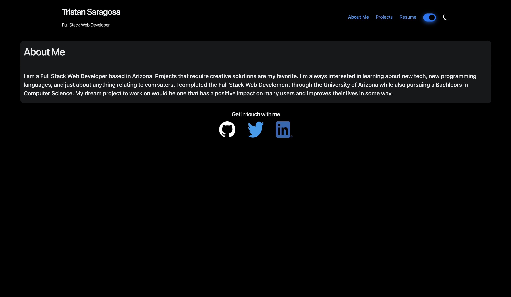

# My Developer Portfolio 

## Description

This is my current professional portfolio as a full stack web developer. Here you can find some information about me,
some of the projects I've worked on or projects I'm currently working on, some of my proficiencies, and a downloadable resume. There are also links
to places where you can contact me located in the footer.

## Table of Contents 

- [Installation](#Installation)
- [Usage](#Usage)
- [Credits](#Credits)
- [License](#License)

## Installation

N/A

## Usage

Each link in the navbar will take you to their corresponding page. You can also play around with the slider to change the theme. All of the content cards in the projects page have a button that wil take
you to the deployed version of the applications. Visit the deployed application here: https://trufl.github.io/my-dev-portfolio/#about-me

Example of the deloyed application:

## Credits

N/A 

## License

See LICENSE above